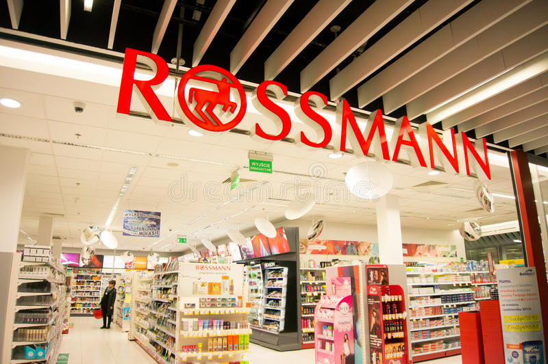

# RossmannStore - Forescasting Sales

---

# 1.0 CONTEXT

Rossmann operates over 3,000 drug stores in 7 European countries. Currently, Rossmann store managers are tasked with predicting their daily sales for up to six weeks in advance. Store sales are influenced by many factors, including promotions, competition, school and state holidays, seasonality, and locality. With thousands of individual managers predicting sales based on their unique circumstances, the accuracy of results can be quite varied. we've found at a kaggle competition, where you can download the dataset here: https://www.kaggle.com/c/rossmann-store-sales/data.

# 2.0. BUSINESS PROBLEM

- What is the context?

    - At a meeting with the leads of each department, the Rossmann's CEO made a proposal to renovate all of their store.

- What is the couse?

    - The Rossmann's CEO want to predict how much each store will sell on next 6 weeks. He need to know if the budget will be enough to make a renovate each store.

- Who will lead the project?

    - We need someone who really know what is the business problem, because he will lead the solution. Therefore, he's our stakeholder.

- How will be our solution?
    - What is the format?
      - granularity(hour,day,product) ---> 6 weeks
      - Problem type(Classification, regression, clustering etc) ---> Regression
      - How we will deliver? (dashboard, csv, telegram bot) ---> Telegram bot
      
 # 3.0. TELEGRAM BOT
 
 
 # 4.0. DATA DESCRIPTION
 
 ## 4.1. Data Types
 
 This step is important for us to understand what is the type of our features. Therefore, we need to treat each variable according to its specific type ... for example, we cannot treat a date as a number or as a text, we cannot treat a number as a text. It is necessary for us to understand the context of our business for the changes to be made.

As we can see below, our columns "date" is like a "object"...we will change it to "datetime" type.
 

## 4.2. Fillout NA

This step is extremely important because our machine learning algorithms are not able of handling null values. To solve this problem there is no right answer, it will depend on your business context, we have to be aware of it and test what will be best suited to that situation. There are three ways to fix this.

Exclude lines with null values.
Replace with the average or median, for example.
Change according to the business context.
This choice is very important because, if we choose to exclude the rows from our data set, depending on the amount of null values, we will eliminate a considerable amount of data so that our model could train.

As I said above, there is no 100% correct or 100% wrong answer about how you should treat the missing values in your dataset. Every choice has a waiver. You have to be aware of this and test what will best suit that situation.

Therefore, this section will focus on filling in these null values. For that to happen, I chose to use the business context to solve our problem. Below, we will explain each change.

- competition_distance
    - This variable tells us how far the nearest competitor is from our store. I chose to replace it with 200000, as this will be big enough to tell us that there is no competitor close to our store.

- competition_open_since_month
    - This column tells us how long in months the competing store opened. We will replace it with the month that was filled in the date column.

- competition_open_since_year
    - This column tells us how long in years the competing store has opened. We will replace it with the year that was filled in the date column.

- promo2_since_week
    -   describes the calendar week when the store started participating in Promo2. We will extract the week from the date column and replace the values that are null.

- promo2_since_year
    - describes the year when the store started participating in Promo2. We will extract the year from the date column and replace the values that are null.

- promo_interval
    - describes the consecutive intervals Promo2 is started, naming the months the promotion is started anew. E.g. "Feb,May,Aug,Nov" means each round starts in February, May, August, November of any given year for that store. We replaced the null values with 0 and checked if the store participated in promo2 or not represented by 0 and 1.
    
After fillout na:

## 4.3. Statistical Descriptive

Let's look at our "sales" column

- Min = 0, means that on that day the store was closed.
- Max = 41551
- Mean = It tells us that on average, 5773 sales are made per day.
- Median = Median very close to the average
- Std = Tell us that our sales may vary by +/- 3849, that is, there are days that total sales are (5773 + 3849) and there are days that total sales are (5773 - 3849)
- Skew = Informs us how shifted our graph is in relation to the origin.
- Kurtosis = Tells us how "pointy" our distribution is, or how close to a normal distribution it is.

# 5.0. MindMapHypothesis

From the mind map above, we created some features to validate the hypotheses.

# 6.0. Exploratory Data Analysis

## 6.1. Univariate Analysis

As we can see, it is close to a normal distribution, however, it has a positive skewness, so it is shifted to the left. 

## 6.2. Numerical Variables

- competition_distance -> we can see that we have bigger concentrations in smaller intervals. So, there's a lot close competitors.

- competition_open_since_month -> has an increase until the fourth month and reaches the maximum. From that there is a fall. Therefore, this feature has a certain variation.

- day_of_week -> There is no variation, so, the day of the week will not influence sales. There is no variation.

- is_promo -> we have a lot more sales when there are no promotions. This can be an insight, we will check soon.

- promo2_since_year -> there is a very high peak in 2013, we need to check what happened that year.

## 6.2. Categorical Variables

- state_holiday -> We have a much larger amount of sales on public holidays, but at Christmas, which has a smaller amount of sales than easter_holiday, it has a higher peak.

- store_type -> The store_type "a" that sells more, does not have such a peak compared to the others.

- assortment -> We see that stores with the "extra" type assortment sell less, but have a higher distribution. So, there are stores that sell more with the "extra" assortment and stores that sell less.
